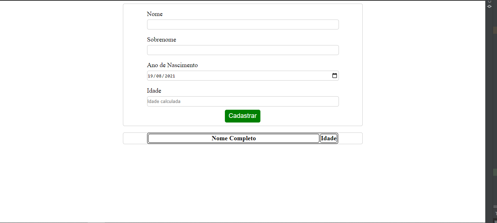

# Exercício aula-20

1. Desenvolva um código que represente a imagem abaixo.
1. O Campo `Idade`  não deve permitir entrada do usuário, este será preenchido via JS durante a aula
1. A parte inferior onde exibe `Nome Completo` e `Idade` representa o cabeçalho de uma tabela. Esta deve conter seu _body_ vazio.
1. Sua aplicação deve ser respansiva
1. O conteúdo deve ocupar **80%** do _card_
1. o conteúdo exibido deve oupar **50%** da tela com máximo em **700px**

