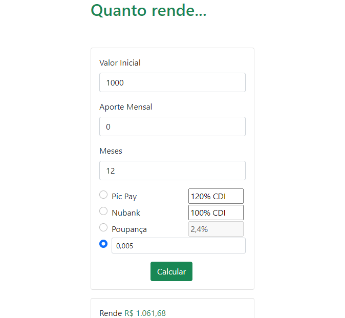

# Exercício aula-22

Com base no modelo abaixo, desenvolva uma aplicação para calcular os possíveis rendimentos de uma aplicação.

**Nota 1**
>Sabendo que o CDI é uma taxa que varia todos os dias, utilizaremos o a Taxa CDI como uma média calculada até o dia corrente entre as taxas acumuladas durante o período.\
> CDI = 0,005

**Nota 2**
>Tome como base as seguintes nomenclaturas:
> 1. M = Montante Acumulado
> 1. C = Capital Inicial
> 1. t = taxa
> 1. i = período
> 1. a = aporte

**Nota 3**
>Sabendo que para calcular os rendimentos temos a seguinte fórmula:\
> `M = C * (1+t)^i + (aporte * ((1+t)^i -1)/t)`

Definições
1. O retorno deve ser exibido como formato monetário
1. O campo valor inicial deve ser obrigatório
1. O taxa deve ser obrigatório
1. Ao selecionar PickPay deve-se utilizar 120% da CDI, podendo utilizar uma taxa personalizada
1. Ao selecionar Nubank deve-se utlizar 100% CDI, podendo ser personalizada
1. Ao Selecionar Poupança deve-se utilizar a taxa de 0,0024
1. Ao Selecionar Outro
deve-se utilizar a taxa informada
1. Ao clicar em qualquer input ou label deve selecionar o _radio button_ correspondente

[link](https://forex-social.com/ferramentas/calculadora-lucros-aportes/) para validação de cálculos.

