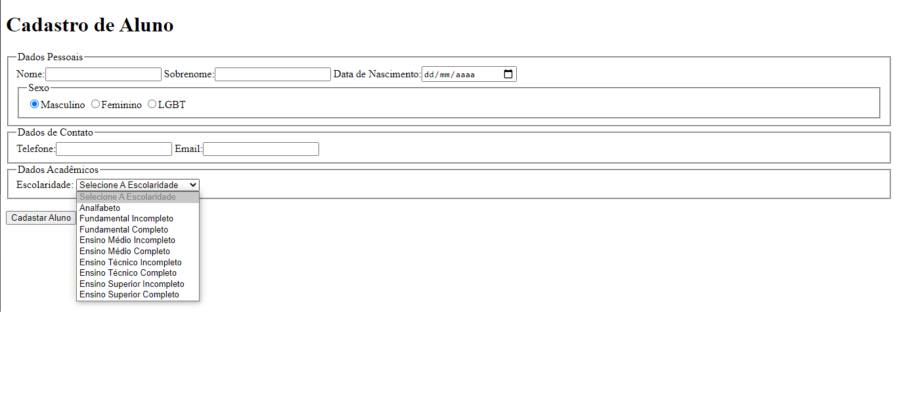

# Exercícios

## Aula 03

### Definições
1. Os campos `Nome`, `Sobrenome`, `Data de Nascimento`, `Telefone`, `Email` e  `Escolaridade` devem ser de preenchimento obrigatório.

2. A `Escolaridade`deve conter os seguintes itens:
  - Selecione A Escolaridade
  - Analfabeto
  - Fundamental Incompleto
  - Fundamental Completo
  - Ensino Médio Incompleto
  - Ensino Médio Completo
  - Ensino Técnico Incompleto
  - Ensino Técnico Completo
  - Ensino Superior Incompleto
  - Ensino Superior Completo
3. Sendo **Selecione A Escolaridade** como um valor não selecionável.
4. Garanta que ao menos um sexo seja selecionado

.

