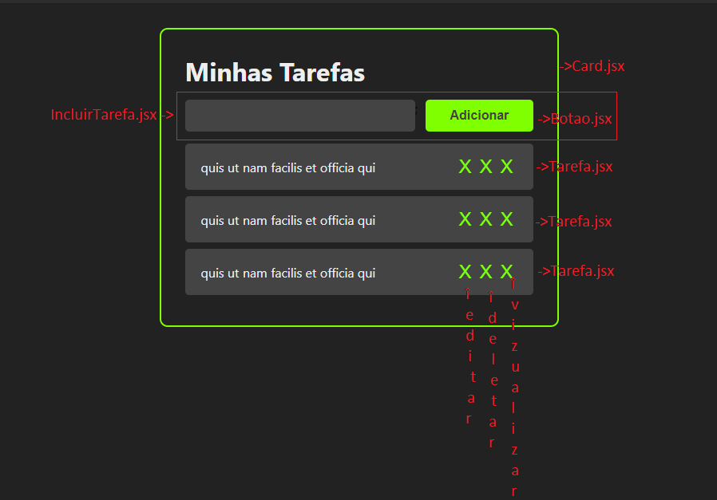
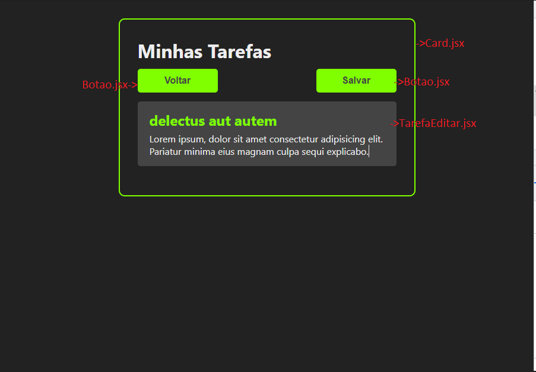
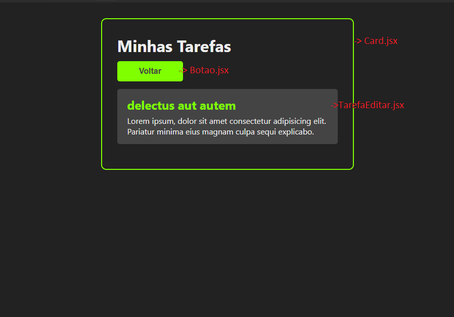

# Exercícios aula-29

Dado o modelo exbido e iniciado em aula, finalize a parte vizual da aplicação para que tenha os seguintes componentes:

1. `Card.jsx` - responsável por conter todo o conteúdo da aplicação, assim como criar a delimitação
1. `Card.jsx` - deve ser capáz de compor outros componentes assim como uma lista de tarefas
1. `IncuirTarefa.jsx` - componente responsável inserir nova tarefa a lista (a funcionalidade sera feita em aula)
1. `Butao.jsx`- responsável por receber ações a ser tomadas
1. `Tarefa.jsx` - responsável por armazenar o título de uma tarefa, além de conter 3 micro botões de ação(que serão vistos em aula)
 modelo
1. `TarefaEditar.jsx` responsável por exibir o título e conteúdo da tarefa, podensendo ser ~somente vizualização ou edição, dependendo de como for chamado

Segue abaixo os modelos

